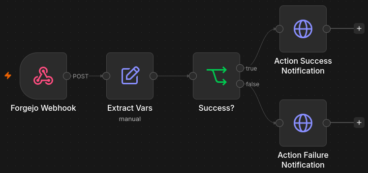
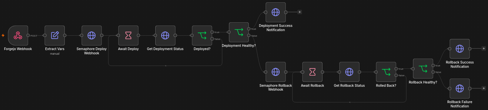

# Home Lab

Infrastructure as code for a NixOS based server hosting 70+ services in one
Docker Compose project, a signed and scanned image pipeline, and automated
deployment with rollback. This repository only contains select files and does
not reflect the directory structure of my server. Secrets, environment files and
machine-specific IDs are redacted.

## Architecture

<!-- d2 diagram to be added: Forgejo Actions -> n8n -> Semaphore ->
 Docker Compose stack on NixOS host; n8n -> Apprise notifications -->

1. **Build:** [Forgejo Actions](https://codeberg.org/forgejo/forgejo) builds
 each image, generates an SBOM, scans it with
 [Trivy](https://github.com/aquasecurity/trivy), then pushes and signs it with
 [cosign](https://github.com/sigstore/cosign).
2. **Orchestrate:** A CI job calls a webhook on
 [n8n](https://github.com/n8n-io/n8n), which starts a deployment in
 [Ansible Semaphore](https://github.com/semaphoreui/semaphore) and polls it to
 completion.
3. **Deploy:** Semaphore runs an [Ansible](https://github.com/ansible/ansible)
 playbook on the Docker host that records the running image tag, rolls out the
 new one and health-checks it.
4. **Recover:** If the deployment fails, n8n starts a rollback task and reports
 the outcome through [Apprise](https://github.com/caronc/apprise), escalating if
 the rollback fails too.
5. **Run:** The target is a [Docker Compose](https://github.com/docker/compose)
 stack behind [Traefik](https://github.com/traefik/traefik), on a
 [NixOS](https://github.com/NixOS/nixpkgs) host with
 [ZFS](https://github.com/openzfs/zfs) storage.
6. **Access:** Default-deny firewall, segmented Docker networks, and privileged
 mode confined to hardware-bound services. All services, except for one public
 game server, are  only reachable from the local network or via an the Wireguard
 server hosted on my OpenWRT-based router.
7. **Observe:** [Grafana Alloy](https://github.com/grafana/alloy),
 [VictoriaMetrics](https://github.com/VictoriaMetrics/VictoriaMetrics) and
 [Grafana](https://github.com/grafana/grafana) cover metrics and logs, with
 quick access via [Glance](https://github.com/glanceapp/glance).

## Components

| Directory | Role | Key technologies |
| --- | --- | --- |
| [`docker/`](docker/) | The platform: Main 59-service Compose stack featuring three custom images | Docker Compose, Traefik, PostgreSQL, Grafana Alloy |
| [`forgejo/`](forgejo/) | CI/CD pipeline: build, scan, sign, publish | Forgejo Actions, Trivy, cosign, Renovate |
| [`n8n/`](n8n/) | Orchestration between CI, deployment and notifications | n8n, Apprise, ntfy |
| [`semaphore/`](semaphore/) | Deploy and rollback playbooks | Ansible, Semaphore |
| [`nix/`](nix/) | Declarative host configuration | NixOS, disko, Home Manager, sops-nix |
| [`grafana/`](grafana/) | Telemetry collection and server dashboard | Grafana Alloy, Grafana, VictoriaMetrics, VictoriaLogs |

## Screenshots

**n8n pipeline called across multiple repositories**

**n8n pipeline called primarily by my
 [ADSB telemetry API project](https://github.com/lealewisdev/OverheadADS-B)**

**Dashboard for quick status overview and accessing services**

**

## TODO

- Finish D2 diagrams
- Set up secondary OpenBSD server for hosting externally accessible websites
- Harden PostgreSQL user privileges
- Convert primary server's primary drive to ZFS + ZFS snapshots
- Create and host new service to replace 'Canon Selphy' app
- Re-flash router with vanilla OpenWRT

## Not Planned

- **Failover**: Availability relies on restart policies, health checks and
 monitoring, although I would prefer to migrate from Docker Compose to K3s.

**Skills demonstrated:** IAC · CI/CD and supply-chain security ·
 container orchestration · network segmentation · secrets management ·
 observability · Linux system administration
