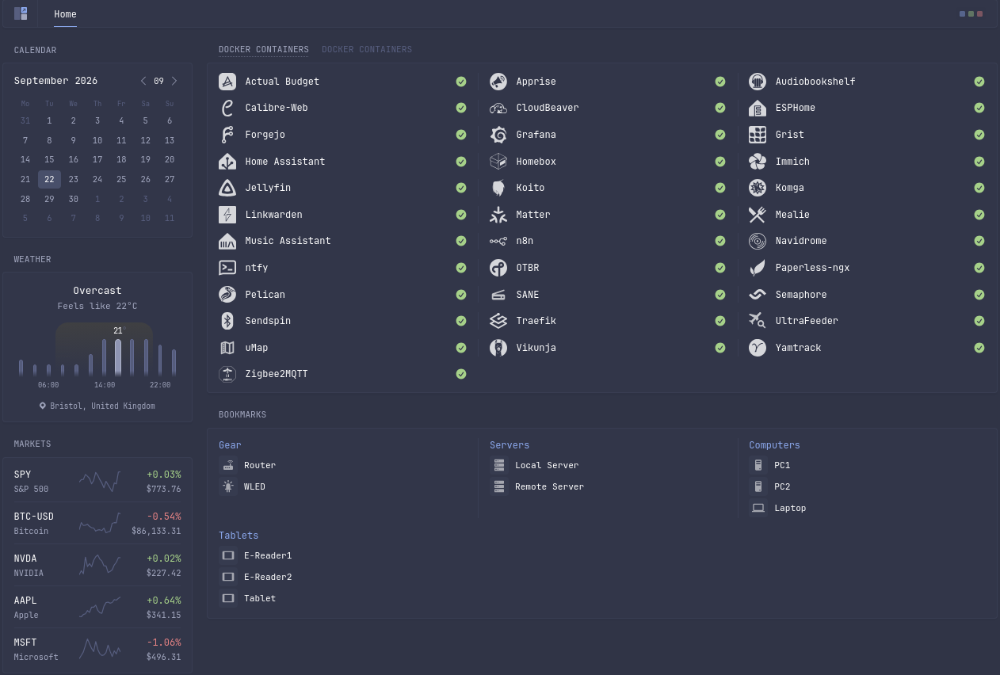

# Home Lab

Infrastucture as code for a NixOS based server hosting 70+ services in one Docker Compose project, a signed and scanned image pipeline, and automated deployment with rollback. Soon to be joined by an OpenBSD based secondary server

## Architecture

<!-- d2 diagram to be added: Forgejo Actions -> n8n -> Semaphore -> Docker Compose stack on NixOS host; n8n -> Apprise notifications -->

1. **Build.** [Forgejo Actions](https://codeberg.org/forgejo/forgejo) builds each image, generates an SBOM, scans it with [Trivy](https://github.com/aquasecurity/trivy), then pushes and signs it with [cosign](https://github.com/sigstore/cosign).
2. **Orchestrate.** A CI job calls a webhook on [n8n](https://github.com/n8n-io/n8n), which starts a deployment in [Ansible Semaphore](https://github.com/semaphoreui/semaphore) and polls it to completion.
3. **Deploy.** Semaphore runs an [Ansible](https://github.com/ansible/ansible) playbook on the Docker host that records the running image tag, rolls out the new one and health-checks it.
4. **Recover.** If the deployment fails, n8n starts a rollback task and reports the outcome through [Apprise](https://github.com/caronc/apprise), escalating if the rollback fails too.
5. **Run.** The target is a [Docker Compose](https://github.com/docker/compose) stack behind [Traefik](https://github.com/traefik/traefik), on a [NixOS](https://github.com/NixOS/nixpkgs) host with [ZFS](https://github.com/openzfs/zfs) storage.

## Components

| Directory | Role | Key technologies |
| --- | --- | --- |
| [`docker/`](docker/) | The platform: Main 59-service Compose stack featuring three custom images | Docker Compose, Traefik, PostgreSQL, Grafana Alloy |
| [`forgejo/`](forgejo/) | CI/CD pipeline: build, scan, sign, publish | Forgejo Actions, Trivy, cosign, Renovate |
| [`n8n/`](n8n/) | Orchestration between CI, deployment and notifications | n8n, Apprise, ntfy |
| [`semaphore/`](semaphore/) | Deploy and rollback playbooks | Ansible, Semaphore |
| [`nix/`](nix/) | Declarative host configuration | NixOS, disko, Home Manager, sops-nix |

## Highlights

- **Infrastructure as code.** The host OS, disk layout, services, pipelines and playbooks are all version-controlled and reproducible.
- **Supply-chain security.** Images carry an SBOM, are blocked on fixable CRITICAL/HIGH vulnerabilities, are cosign-signed, and are re-scanned daily after publication.
- **Self-healing deploys.** Rollouts are health-gated, roll back automatically and escalate if the rollback itself fails.
- **Least privilege.** A default-deny firewall, segmented Docker networks, and privileged mode confined to hardware-bound services.
- **Observability.** [Grafana Alloy](https://github.com/grafana/alloy), [VictoriaMetrics](https://github.com/VictoriaMetrics/VictoriaMetrics) and [Grafana](https://github.com/grafana/grafana) cover metrics and logs, with quick acessability via [Glance](https://github.com/glanceapp/glance).

## Notes, scope and trade-offs

- **Single host.** For now there is no failover; availability relies on restart policies, health checks and monitoring.
- **LAN-only.** Services are reachable only from the local network, apart from one game server.
- **Snapshot of a live system.** Files are copied from the running host, so paths differ from the layout here. For example, `configuration.nix` lives in `/etc/nixos` and each custom image sits in its own build context beside `compose.yaml`. Secrets, environment files and machine-specific configuration are omitted.

## Screenshots

")

)

## TODO
- Secondary OpenBSD server for hosting websites
- Hardening Postgres user priviledges
- Convert primary servers primary drive to ZFS + ZFS snapshots
- Create and host new service to replace Canon Selphy app

**Skills demonstrated:** infrastructure as code · CI/CD and supply-chain security · container orchestration · network segmentation · secrets management · observability · Linux system administration
